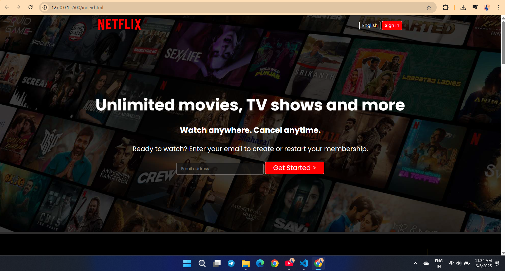
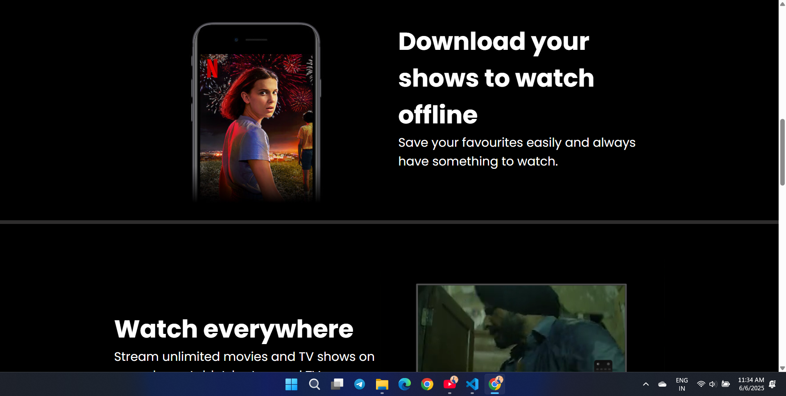
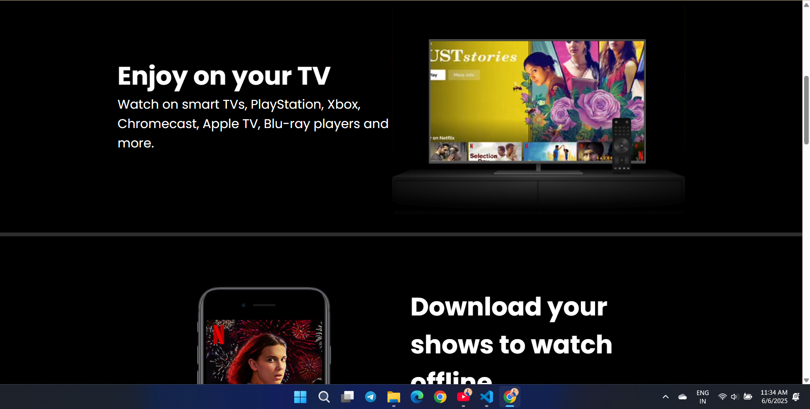
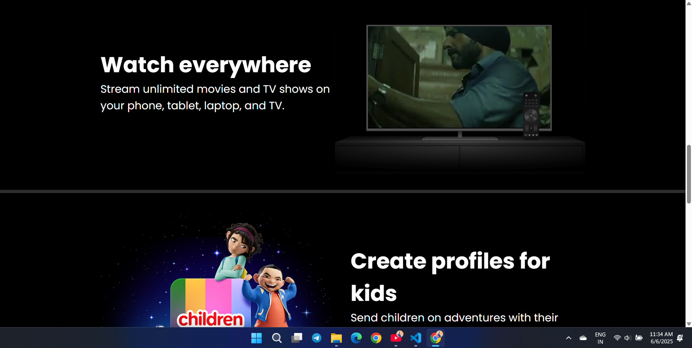
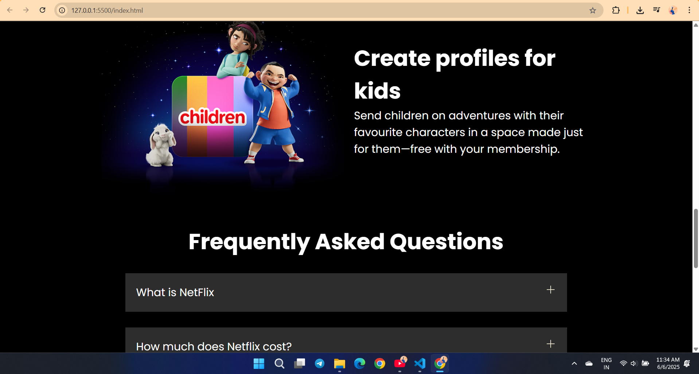
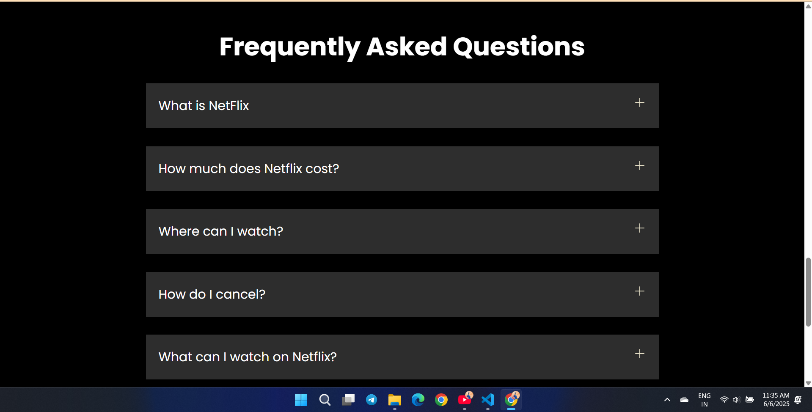

#Netflix Clone Website Project Using HTML & CSS

This project is a static recreation of Netflix’s homepage, built solely with HTML5 and CSS3. It aims to replicate Netflix’s clean, modern UI and responsive layout, allowing you to study how Flexbox and CSS Grid can be used to craft a professional streaming-style interface. No JavaScript or backend is included—everything is handled through semantic HTML and modular CSS.

*Content Carousels (Rows):
Multiple “rows” of movie/series thumbnails organized with CSS Grid.
Hover effects on thumbnails to simulate Netflix’s hover preview style.

*Organized File Structure:
Separate HTML files or sections for header, hero, content rows, and footer.
A single style.css file demonstrating best practices: variables, BEM-like class naming, and DRY principles.

*Pure UI/UX Focus:
No JavaScript logic or server-side code—ideal for front-end practice.
Emphasizes semantic HTML tags and modular, reusable CSS classes.

## 📽️ Demo Video

[🎬 Click here to watch the demo video](./Asset/images/videoRec.mp4)

## 📸 Screenshots

### 🏠 Homepage (Landing Page)

### 📄 Scroll View 1

### 📄 Scroll View 2

### 📄 Scroll View 3

### 📄 Scroll View 4

### 📄 Scroll View 5

